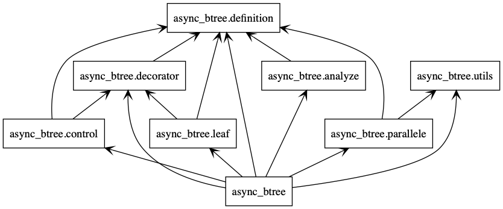

# Package Overview

We define several packages:

- [definition](definition.md): common model definition
- [leaf](leaf.md): leaf node implementation
- [decorator](decorator.md): decorator node implementation
- [control](control.md): control node implementation
- [parallele](parallele.md): a specific parallele node implementation with curio
- [analyze](analyze.md): analyze function to dynamically analyze behaviour tree
- [utils](utils.md): few async function implementation to hide complexity
